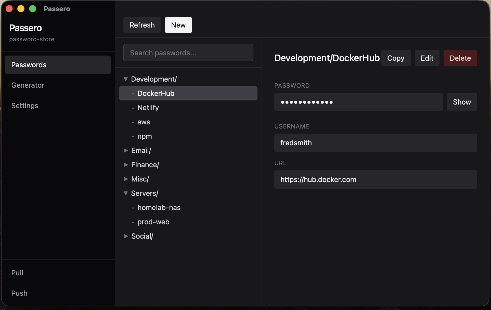
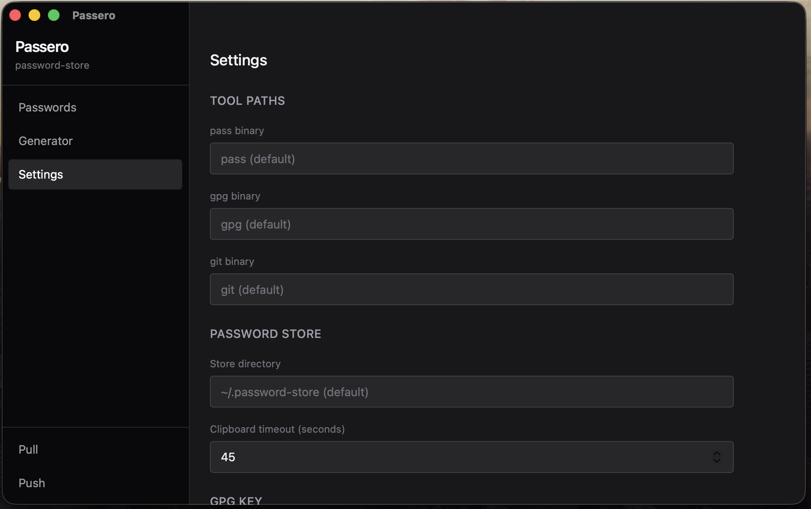

<p align="center">
  <picture>
    <source media="(prefers-color-scheme: dark)" srcset="docs/passero-light.png" width="120">
    <source media="(prefers-color-scheme: light)" srcset="docs/passero.png" width="120">
    
  </picture>
</p>

<h1 align="center">Passero</h1>

<p align="center">
  A desktop GUI for <a href="https://www.passwordstore.org/">pass</a>, the standard Unix password manager.<br>
  Built with <a href="https://v2.tauri.app/">Tauri 2</a>, <a href="https://svelte.dev/">Svelte 5</a>, and Rust.
</p>

<p align="center">
  
</p>

## Features

- **Browse** your password store as a searchable tree
- **View, copy, edit, and delete** entries
- **Generate** passwords via `pass generate`
- **Git sync** — pull and push from the sidebar
- **GPG key management** — view keys, select store key
- **Configurable** — custom paths for `pass`, `gpg`, `git`, and store directory
- **Cross-platform** — macOS, Linux, Windows (planned)

## Screenshots

| Passwords | Settings |
|:-:|:-:|
|  |  |

## Install

### Homebrew (macOS)

```bash
brew install fredsmith/tap/passero
```

### Download

Grab the latest release from [Releases](https://github.com/fredsmith/Passero/releases).

### Build from source

```bash
git clone https://github.com/fredsmith/Passero.git
cd Passero
npm install
npm run tauri build
```

The built app will be in `src-tauri/target/release/bundle/`.

### Requirements

- [pass](https://www.passwordstore.org/) (bundled as fallback, or uses system install)
- [GPG](https://gnupg.org/) with at least one key pair
- [Git](https://git-scm.com/) (for sync features)

## Development

```bash
npm install
npm run tauri dev
```

## Architecture

- **Frontend**: Svelte 5 with runes, Tailwind CSS 4, Vite
- **Backend**: Rust via Tauri 2 IPC commands
- **Password store**: Calls system `pass` as a subprocess for full ecosystem compatibility
- **Config**: Persistent via `tauri-plugin-store`

## License

MIT
